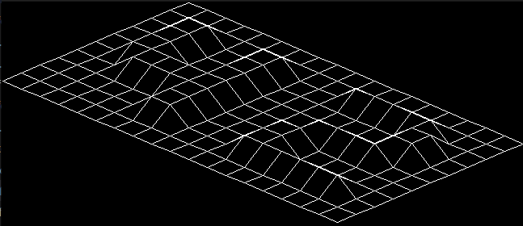

# fdf
This project is about creating a simple wireframe model representation of a 3D landscape by linking various points (x, y, z) thanks to line segments (edges).
___
## Requirements
### Requirements for Linux:
* make
* gcc
* package xorg 
* package libxext-dev 
* package libbsd-dev

➜ Requirements installation for Debian Distributions:
``` shell
sudo apt-get install gcc make xorg libxext-dev libbsd-dev
```

### Requirements for Mac:
* Xquartz

➜ Requirements installation:
``` shell
Brew install Xquartz
reboot
xeyes
```

## Installation
``` shell
git clone https://github.com/irhesri/fdf.git
cd fdf
make bonus
```

## Usage
* Start The executable:
``` 
./fdf_bonus [map name]
```
>Note:
>* If the map doesn't exist in the same directory you should provide the path along with name [path/name].
>* The map extension should always be **.fdf**

### The map:
Each number represents a point in space:
 * The horizontal position corresponds to its axis.
 * The vertical position corresponds to its ordinate.
 * The value corresponds to its altitude, and it may contain a comma followed by the color of the line in hexa.

#### Exemple :

<div align="center">
  
  
</div>

``` shell
./fdf_bonus ./maps/42.fdf
```
<div align="center">
  



<sup> The map is so big so this is just a part of it </sup>
</div>

``` shell
./fdf_bonus ./maps/elem-fract.fdf
```
<div align="center">
  

</div>

## Controls:
* <kbd> + </kbd> <kbd> - </kbd> : Zoom in and out
* <kbd> ↑ </kbd> <kbd> ↓ </kbd> : Translation up and down
* <kbd> ← </kbd> <kbd> → </kbd> : Translation left and right 
* <kbd> w </kbd> <kbd> s </kbd> : Changing the altitude (z)
* <kbd> a </kbd> <kbd> d </kbd> : Rotation
* <kbd> p </kbd> : Parallel projection
* <kbd> ESC </kbd> : Close the window

## Restrictions:
* Only the next functions are allowed:
>open, close, read, write, malloc, free, perror, strerror, exit
>
>All functions of the math
>
>All functions of the MiniLibX
* You must use the MiniLibX.
* Global variables are forbidden.

## Credits
The mlx library used in the project was provided by [Minilibx](https://github.com/42Paris/minilibx-linux).
